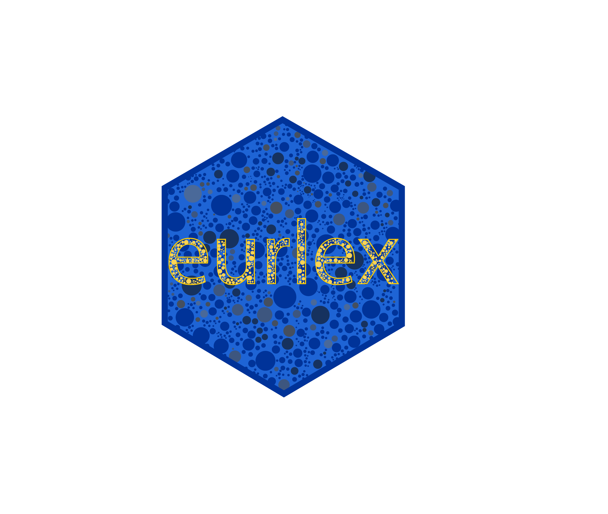

# eurlex 

An R package for retrieving official data on European Union law and policy.

## Installation
Install from CRAN via `install.packages("eurlex")`.

The development version is available via `remotes::install_github("michalovadek/eurlex")`.

## Usage

The `eurlex` R package attempts to significantly reduce the overhead associated with using SPARQL and REST APIs made available by the EU Publication Office. Compared to web-scraping, the package provides simpler, more efficient and transparent access to data on European Union laws and policies.

The `eurlex` package currently envisions the typical use-case to consist of getting bulk information about EU legislation into R as fast as possible. The package contains three core functions to achieve that objective: `elx_make_query()` to create pre-defined or customized SPARQL queries; `elx_run_query()` to execute the pre-made or any other manually input query; and `elx_fetch_data()` to fire GET requests for certain metadata to the REST API.

The function `elx_make_query` takes as its first argument the type of resource to be retrieved (such as "directive") from the semantic database that powers Eur-Lex (and other publications) called Cellar. If you are familiar with SPARQL, you can always specify your own queries and execute them with `elx_run_query()`.

`elx_run_query()` executes SPARQL queries on a pre-specified endpoint of the EU Publication Office. It outputs a `data.frame` where each column corresponds to one of the requested variables, while the rows accumulate observations of the resource type satisfying the query criteria. Obviously, the more data is to be returned, the longer the execution time, varying from a few seconds to several hours, depending also on your connection. The first column always contains the unique URI of a "work" (legislative act or court judgment) which identifies each resource in Cellar. Several human-readable identifiers are normally associated with each "work" but the most useful one is [CELEX](https://eur-lex.europa.eu/content/tools/TableOfSectors/types_of_documents_in_eurlex.html), retrieved by default.

For the moment, it is recommended to retrieve metadata one variable at a time. For example, if you wish to obtain the legal bases of directives and the date of transposition, you should run separate calls:

0. `ids <- elx_make_query("directive") %>% elx_run_query()`
1. `lbs <- elx_make_query("directive", include_lbs = TRUE) %>% elx_run_query()`
2. `dates <- elx_make_query("directive", include_date_transpos = TRUE) %>% elx_run_query()`
3. `ids %>% dplyr::left_join(lbs) %>% dplyr::left_join(dates)`

rather than `elx_make_query("directive", include_lbs = TRUE, include_date_transpos = TRUE)`. This approach should make it easier to understand the returned data frame(s), especially when some variables contain missing or duplicated data. Always keep an eye on whether the `work` and `celex` columns identify rows uniquely or not.

One of the main contributions of the SPARQL requests is that we obtain a comprehensive list of identifiers that we can subsequently use to obtain more data relating to the document in question. While the results of the SPARQL queries are useful also for webscraping (with the `rvest` package), the function `elx_fetch_data()` enables us to fire GET requests to retrieve data on documents with known identifiers (including Cellar URI). The function currently enables downloading the title and the full text of a document in all available languages.

See the [vignette](https://michalovadek.github.io/eurlex/articles/eurlexpkg.html) for a walkthrough on how to use the package. Check function documentation for most up-to-date overview of features. Example use cases are shown in this [paper](https://www.tandfonline.com/doi/full/10.1080/2474736X.2020.1870150).

## Cite
Michal Ovádek (2021) Facilitating access to data on European Union laws, Political Research Exchange, 3:1, DOI: [10.1080/2474736X.2020.1870150](https://www.tandfonline.com/doi/full/10.1080/2474736X.2020.1870150)

## Note
This package nor its author are in any way affiliated with the EU Publications Office. Please refer to the applicable [data reuse policies](https://eur-lex.europa.eu/content/welcome/data-reuse.html).

Please consider contributing to the maintanance and development of the package by reporting bugs or suggesting new features.

## Latest changes

### eurlex 0.3.6

- `elx_run_query()` now fails gracefully in presence of internet/server problems
- `elx_fetch_data()` now automatically fixes urls with parentheses (e.g. "32019H1115(01)" used to fail)
- minor fixes to vignette
- `elx_parse_xml` no longer an exported function

### eurlex 0.3.5

- it is now possible to select all resource types available with `elx_make_query(resource_type = "any")`. Since there are nearly 1 million CELEX codes, use with discretion and expect long execution times
- results can be restricted to a particular directory code with `elx_make_query(directory = "18")` (directory code "18" denotes Common Foreign and Security Policy)
- results can be restricted to a particular sector with `elx_make_query(sector = 2)` (sector code 2 denotes EU international agreements)

- new feature: request date of court case submission `elx_make_query(include_date_lodged = TRUE)`
- new feature: request type of court procedure and outcome `elx_make_query(include_court_procedure = TRUE)`
- new feature: request directory code of legal act `elx_make_query(include_directory = TRUE)`
- `elx_curia_list()` has a new default parameter `parse = TRUE` which creates separate columns for `ecli`, `see_case`, `appeal` applying regular expressions on `case_info`

## Useful resources
Guide to CELEX numbers: https://eur-lex.europa.eu/content/tools/TableOfSectors/types_of_documents_in_eurlex.html

List of resource types in Cellar (NAL): http://publications.europa.eu/resource/authority/resource-type

NAL of corporate bodies:
http://publications.europa.eu/resource/authority/corporate-body

Query builder:
https://op.europa.eu/en/advanced-sparql-query-editor

SPARQL endpoint:
http://publications.europa.eu/webapi/rdf/sparql
