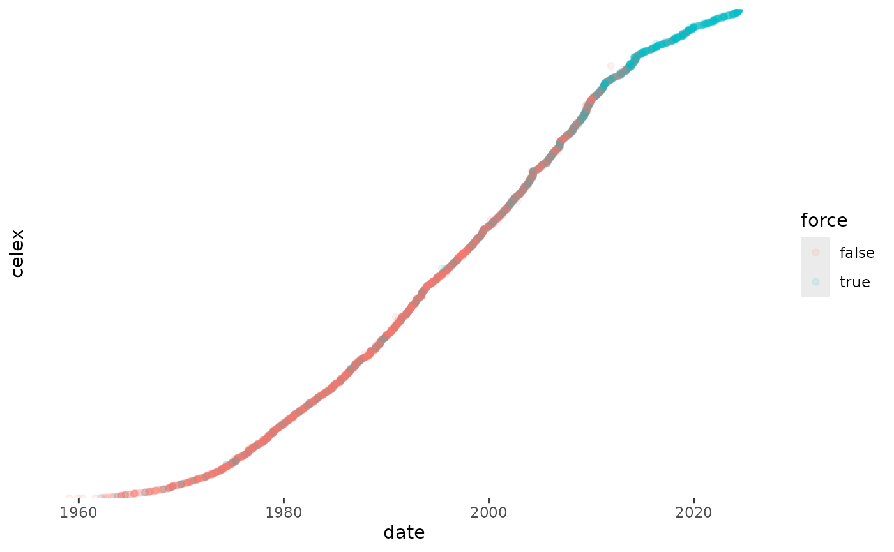

# eurlex: Retrieve data on European Union law in R

This vignette shows how to use the `eurlex` R package to retrieve data
on European Union law.

## Introduction

Dozens of political scientists and legal scholars use data on European
Union laws in their research. The provenance of these data is rarely
discussed. More often than not, researchers resort to the quick and
dirty technique of scraping entire html pages from `eur-lex.europa.eu`.
This is not the optimal, nor preferred (from the perspective of the
server host) approach of retrieving data, however, especially as the
Publication Office of the European Union, the public body behind
Eur-Lex, operates several dedicated APIs for automated retrieval of its
data.

The allure of web scraping is completely understandable. Not only is it
easier to download data that can be readily seen in a user-friendly
manner through a browser, using the dedicated APIs requires technical
knowledge of semantic web and Client URL technologies, which is not
necessarily widespread among researchers. And why go through the pain of
learning how to compile SPARQL queries when it is much easier to simply
download the web page?

The `eurlex` R package attempts to significantly reduce the overhead
associated with using the SPARQL and REST APIs made available by the EU
Publication Office. Although at present it does not offer access to the
same array of information as comprehensive web scraping might, the
package provides simpler, more efficient and transparent access to data
on European Union law. This vignette gives a quick guide to the package
and an even quicker introduction to the Eur-Lex dataverse.

## The `eurlex` package

The `eurlex` package currently envisions the typical use-case to consist
of getting bulk information about EU law and policy into R as fast as
possible. The package contains three core functions to achieve that
objective:
[`elx_make_query()`](https://michalovadek.github.io/eurlex/reference/elx_make_query.md)
to create SPARQL queries based on user input;
[`elx_run_query()`](https://michalovadek.github.io/eurlex/reference/elx_run_query.md)
to execute the pre-made or any other manually input query; and
[`elx_fetch_data()`](https://michalovadek.github.io/eurlex/reference/elx_fetch_data.md)
to fire GET requests for certain metadata to the REST API.

The package also contains largely self-explanatory functions for
retrieving data on EU court cases
([`elx_curia_list()`](https://michalovadek.github.io/eurlex/reference/elx_curia_list.md))
and Council votes (`elx_council_votes()`, currently dysfunctional) from
outside Eur-Lex. More advanced users might be interested in downloading
and custom-parsing XML notices with
[`elx_download_xml()`](https://michalovadek.github.io/eurlex/reference/elx_download_xml.md).

### `elx_make_query()`: Generate SPARQL queries

The function `elx_make_query` takes as its first argument the type of
resource to be retrieved from the semantic database that powers Eur-Lex
(and other publications) called Cellar.

``` r
library(eurlex)
library(dplyr)

query_dir <- elx_make_query(resource_type = "directive")
```

Currently, it is possible to choose from among a host of resource types,
including directives, regulations and even case law (see function
description for the full list). It is also possible to manually specify
a resource type from the [eligible
list](http://publications.europa.eu/resource/authority/resource-type).[¹](#fn1)

The choice of resource type is then reflected in the SPARQL query
generated by the function:

``` r
query_dir %>% 
  cat()
#> PREFIX cdm: <http://publications.europa.eu/ontology/cdm#>
#>   PREFIX annot: <http://publications.europa.eu/ontology/annotation#>
#>   PREFIX skos:<http://www.w3.org/2004/02/skos/core#>
#>   PREFIX dc:<http://purl.org/dc/elements/1.1/>
#>   PREFIX xsd:<http://www.w3.org/2001/XMLSchema#>
#>   PREFIX rdf:<http://www.w3.org/1999/02/22-rdf-syntax-ns#>
#>   PREFIX owl:<http://www.w3.org/2002/07/owl#>
#>   select distinct ?work ?type ?celex where{ ?work cdm:work_has_resource-type ?type. FILTER(?type=<http://publications.europa.eu/resource/authority/resource-type/DIR>||
#>   ?type=<http://publications.europa.eu/resource/authority/resource-type/DIR_IMPL>||
#>   ?type=<http://publications.europa.eu/resource/authority/resource-type/DIR_DEL>) 
#>  FILTER not exists{?work cdm:work_has_resource-type <http://publications.europa.eu/resource/authority/resource-type/CORRIGENDUM>} OPTIONAL{?work cdm:resource_legal_id_celex ?celex.} FILTER not exists{?work cdm:do_not_index "true"^^<http://www.w3.org/2001/XMLSchema#boolean>}. }

elx_make_query(resource_type = "caselaw") %>% 
  cat()
#> PREFIX cdm: <http://publications.europa.eu/ontology/cdm#>
#>   PREFIX annot: <http://publications.europa.eu/ontology/annotation#>
#>   PREFIX skos:<http://www.w3.org/2004/02/skos/core#>
#>   PREFIX dc:<http://purl.org/dc/elements/1.1/>
#>   PREFIX xsd:<http://www.w3.org/2001/XMLSchema#>
#>   PREFIX rdf:<http://www.w3.org/1999/02/22-rdf-syntax-ns#>
#>   PREFIX owl:<http://www.w3.org/2002/07/owl#>
#>   select distinct ?work ?type ?celex where{ ?work cdm:work_has_resource-type ?type. FILTER(?type=<http://publications.europa.eu/resource/authority/resource-type/JUDG>||
#>   ?type=<http://publications.europa.eu/resource/authority/resource-type/ORDER>||
#>   ?type=<http://publications.europa.eu/resource/authority/resource-type/OPIN_JUR>||
#>   ?type=<http://publications.europa.eu/resource/authority/resource-type/THIRDPARTY_PROCEED>||
#>   ?type=<http://publications.europa.eu/resource/authority/resource-type/GARNISHEE_ORDER>||
#>   ?type=<http://publications.europa.eu/resource/authority/resource-type/RULING>||
#>   ?type=<http://publications.europa.eu/resource/authority/resource-type/JUDG_EXTRACT>||
#>   ?type=<http://publications.europa.eu/resource/authority/resource-type/INFO_JUDICIAL>||
#>   ?type=<http://publications.europa.eu/resource/authority/resource-type/VIEW_AG>||
#>   ?type=<http://publications.europa.eu/resource/authority/resource-type/OPIN_AG>) 
#>  FILTER not exists{?work cdm:work_has_resource-type <http://publications.europa.eu/resource/authority/resource-type/CORRIGENDUM>} OPTIONAL{?work cdm:resource_legal_id_celex ?celex.} FILTER not exists{?work cdm:do_not_index "true"^^<http://www.w3.org/2001/XMLSchema#boolean>}. }

elx_make_query(resource_type = "manual", manual_type = "SWD") %>% 
  cat()
#> PREFIX cdm: <http://publications.europa.eu/ontology/cdm#>
#>   PREFIX annot: <http://publications.europa.eu/ontology/annotation#>
#>   PREFIX skos:<http://www.w3.org/2004/02/skos/core#>
#>   PREFIX dc:<http://purl.org/dc/elements/1.1/>
#>   PREFIX xsd:<http://www.w3.org/2001/XMLSchema#>
#>   PREFIX rdf:<http://www.w3.org/1999/02/22-rdf-syntax-ns#>
#>   PREFIX owl:<http://www.w3.org/2002/07/owl#>
#>   select distinct ?work ?type ?celex where{ ?work cdm:work_has_resource-type ?type.FILTER(?type=<http://publications.europa.eu/resource/authority/resource-type/SWD>) 
#>  FILTER not exists{?work cdm:work_has_resource-type <http://publications.europa.eu/resource/authority/resource-type/CORRIGENDUM>} OPTIONAL{?work cdm:resource_legal_id_celex ?celex.} FILTER not exists{?work cdm:do_not_index "true"^^<http://www.w3.org/2001/XMLSchema#boolean>}. }
```

There are various ways of querying the same information in the Cellar
database due to the existence of several overlapping classes and
identifiers describing the same resources. The queries generated by the
function should offer a reliable way of obtaining exhaustive results, as
they have been validated by the helpdesk of the Publication Office. At
the same time, it is always possible there will be issues either on the
query or the database side; please report any you encounter through
Github.

The other arguments in
[`elx_make_query()`](https://michalovadek.github.io/eurlex/reference/elx_make_query.md)
relate to additional metadata to be returned. The results include by
default the [CELEX
number](https://eur-lex.europa.eu/content/tools/TableOfSectors/types_of_documents_in_eurlex.html)
and exclude corrigenda (corrections of errors in legislation). Other
data needs to be opted into. Make sure to select ones that are logically
compatible (e.g. case law does not have a legal basis). More options
should be added in the future.

Note that availability of data for each variable might have an impact on
the results. The data frame returned by the query might be shrunken to
the size of the variable with most missing data. It is recommended to
always compare results from a desired query to a minimal query
requesting only celex ids.

``` r
# minimal query: elx_make_query(resource_type = "directive")
elx_make_query(resource_type = "directive", include_date = TRUE, include_force = TRUE) %>% 
  cat()
#> PREFIX cdm: <http://publications.europa.eu/ontology/cdm#>
#>   PREFIX annot: <http://publications.europa.eu/ontology/annotation#>
#>   PREFIX skos:<http://www.w3.org/2004/02/skos/core#>
#>   PREFIX dc:<http://purl.org/dc/elements/1.1/>
#>   PREFIX xsd:<http://www.w3.org/2001/XMLSchema#>
#>   PREFIX rdf:<http://www.w3.org/1999/02/22-rdf-syntax-ns#>
#>   PREFIX owl:<http://www.w3.org/2002/07/owl#>
#>   select distinct ?work ?type ?celex ?date ?force where{ ?work cdm:work_has_resource-type ?type. FILTER(?type=<http://publications.europa.eu/resource/authority/resource-type/DIR>||
#>   ?type=<http://publications.europa.eu/resource/authority/resource-type/DIR_IMPL>||
#>   ?type=<http://publications.europa.eu/resource/authority/resource-type/DIR_DEL>) 
#>  FILTER not exists{?work cdm:work_has_resource-type <http://publications.europa.eu/resource/authority/resource-type/CORRIGENDUM>} OPTIONAL{?work cdm:resource_legal_id_celex ?celex.} OPTIONAL{?work cdm:work_date_document ?date.} OPTIONAL{?work cdm:resource_legal_in-force ?force.} FILTER not exists{?work cdm:do_not_index "true"^^<http://www.w3.org/2001/XMLSchema#boolean>}. }

# minimal query: elx_make_query(resource_type = "recommendation")
elx_make_query(resource_type = "recommendation", include_date = TRUE, include_lbs = TRUE) %>% 
  cat()
#> PREFIX cdm: <http://publications.europa.eu/ontology/cdm#>
#>   PREFIX annot: <http://publications.europa.eu/ontology/annotation#>
#>   PREFIX skos:<http://www.w3.org/2004/02/skos/core#>
#>   PREFIX dc:<http://purl.org/dc/elements/1.1/>
#>   PREFIX xsd:<http://www.w3.org/2001/XMLSchema#>
#>   PREFIX rdf:<http://www.w3.org/1999/02/22-rdf-syntax-ns#>
#>   PREFIX owl:<http://www.w3.org/2002/07/owl#>
#>   select distinct ?work ?type ?celex ?date ?lbs ?lbcelex ?lbsuffix where{ ?work cdm:work_has_resource-type ?type. FILTER(?type=<http://publications.europa.eu/resource/authority/resource-type/RECO>||
#>                    ?type=<http://publications.europa.eu/resource/authority/resource-type/RECO_DEC>||
#>                    ?type=<http://publications.europa.eu/resource/authority/resource-type/RECO_DIR>||
#>                    ?type=<http://publications.europa.eu/resource/authority/resource-type/RECO_OPIN>||
#>                    ?type=<http://publications.europa.eu/resource/authority/resource-type/RECO_RES>||
#>                    ?type=<http://publications.europa.eu/resource/authority/resource-type/RECO_REG>||
#>                    ?type=<http://publications.europa.eu/resource/authority/resource-type/RECO_RECO>||
#>                    ?type=<http://publications.europa.eu/resource/authority/resource-type/RECO_DRAFT>) 
#>  FILTER not exists{?work cdm:work_has_resource-type <http://publications.europa.eu/resource/authority/resource-type/CORRIGENDUM>} OPTIONAL{?work cdm:resource_legal_id_celex ?celex.} OPTIONAL{?work cdm:work_date_document ?date.} OPTIONAL{?work cdm:resource_legal_based_on_resource_legal ?lbs.
#>     ?lbs cdm:resource_legal_id_celex ?lbcelex.
#>     OPTIONAL{?bn owl:annotatedSource ?work.
#>     ?bn owl:annotatedProperty <http://publications.europa.eu/ontology/cdm#resource_legal_based_on_resource_legal>.
#>     ?bn owl:annotatedTarget ?lbs.
#>     ?bn annot:comment_on_legal_basis ?lbsuffix}} FILTER not exists{?work cdm:do_not_index "true"^^<http://www.w3.org/2001/XMLSchema#boolean>}. }
```

You can also decide to not specify any resource types, in which case all
types of documents will be returned. As there are over a million
documents with a CELEX identifier, this is likely not efficient for a
majority of users. But since version 0.3.5 it is possible to request
documents belonging to a particular
[“sector”](https://eur-lex.europa.eu/content/tools/TableOfSectors/types_of_documents_in_eurlex.html)
or [directory
code](https://eur-lex.europa.eu/browse/directories/legislation.html).

``` r
# request documents from directory 18 ("Common Foreign and Security Policy")
# and sector 3 ("Legal acts")

elx_make_query(resource_type = "any",
               directory = "18",
               sector = 3) %>% 
  cat()
#> PREFIX cdm: <http://publications.europa.eu/ontology/cdm#>
#>   PREFIX annot: <http://publications.europa.eu/ontology/annotation#>
#>   PREFIX skos:<http://www.w3.org/2004/02/skos/core#>
#>   PREFIX dc:<http://purl.org/dc/elements/1.1/>
#>   PREFIX xsd:<http://www.w3.org/2001/XMLSchema#>
#>   PREFIX rdf:<http://www.w3.org/1999/02/22-rdf-syntax-ns#>
#>   PREFIX owl:<http://www.w3.org/2002/07/owl#>
#>   select distinct ?work ?type ?celex where{
#>     VALUES (?value)
#>     { (<http://publications.europa.eu/resource/authority/fd_555/18>)
#>       (<http://publications.europa.eu/resource/authority/dir-eu-legal-act/18>)
#>     }
#>     {?work cdm:resource_legal_is_about_concept_directory-code ?value.
#>     }
#>     UNION
#>     {?work cdm:resource_legal_is_about_concept_directory-code ?directory.
#>       ?value skos:narrower+ ?directory.
#>     }
#>     
#>     ?work cdm:resource_legal_id_sector ?sector.
#>     FILTER(str(?sector)='3')
#>      
#>  FILTER not exists{?work cdm:work_has_resource-type <http://publications.europa.eu/resource/authority/resource-type/CORRIGENDUM>} OPTIONAL{?work cdm:resource_legal_id_celex ?celex.} FILTER not exists{?work cdm:do_not_index "true"^^<http://www.w3.org/2001/XMLSchema#boolean>}. }
```

Now that we have a query, we are ready to run it.

### `elx_run_query()`: Execute SPARQL queries

[`elx_run_query()`](https://michalovadek.github.io/eurlex/reference/elx_run_query.md)
sends SPARQL queries to a pre-specified endpoint. The function takes the
query string as the main argument, which means you can manually pass it
any working SPARQL query (relevant to official EU publications).

``` r
results <- elx_run_query(query = query_dir)

# the functions are compatible with piping
# 
# elx_make_query("directive") %>% 
#   elx_run_query()
```

``` r
head(results)
#>                                    work type      celex
#> 1  469391ea-6c79-4680-84aa-c33db274e271  DIR 31979L0173
#> 6  e8fcaf0d-443a-40ec-b778-34b7d895d334  DIR 31989L0194
#> 11 52639f5f-ecaf-4f99-b633-e954cea5c8f3  DIR 31984L0378
#> 16 c7560407-689b-4752-9fb0-d0624ed83a19  DIR 31966L0683
#> 21 803aa7a4-5a22-493a-ae02-eb2751bff578  DIR 31993L0004
#> 26 a9ab7f4b-0630-49f4-b6e1-2a92c635fefa  DIR 31992L0017
```

The function outputs a `data.frame` where each column corresponds to one
of the requested variables, while the rows accumulate observations of
the resource type satisfying the query criteria. Obviously, the more
data is to be returned, the longer the execution time, varying from a
few seconds to several minutes, depending also on your connection.

The first column always contains the unique URI of a “work” (legislative
act or court judgment) which identifies each resource in Cellar. Several
human-readable identifiers are normally associated with each “work” but
the most useful one is CELEX, retrieved by default.[²](#fn2)

One column you should always pay attention to is `type` (as in
`resource_type`). The URIs contained there reflect the FILTER argument
in the SPARQL query, which is manually pre-specified. All resources are
indexed as being of one type or another. For example, when retrieving
directives, the results are going to return also delegated directives,
which might not be desirable, depending on your needs. You can filter
results by `type` to make the necessary adjustments. The queries are
expansive by default in the spirit of erring on the side of
over-inclusiveness rather than vice versa.

``` r
head(results$type,5)
#> [1] "DIR" "DIR" "DIR" "DIR" "DIR"

results %>% 
  distinct(type)
#>       type
#> 1      DIR
#> 2 DIR_IMPL
#> 3  DIR_DEL
```

The data is returned in the long format, which means that rows are
recycled up to the length of the variable with the most data points. For
example, if 20 directives are returned, each with two legal bases, the
resulting `data.frame` will have 40 rows. Some variables, such as dates,
contain unexpectedly several entries for some documents. You should
always check the number of unique identifiers in the results instead of
assuming that each row is a unique observation.

#### EuroVoc descriptors

EuroVoc is a multilingual thesaurus, keywords from which are used to
describe the content of European Union documents. Most resource types
that can be retrieved with the pre-defined queries in this package can
be accompanied by EuroVoc keywords and these can be retrieved as other
variables.

``` r
rec_eurovoc <- elx_make_query("recommendation", include_eurovoc = TRUE, limit = 10) %>% 
  elx_run_query() # truncated results for sake of the example

rec_eurovoc %>% 
  select(celex, eurovoc)
#>             celex                       eurovoc
#> 1      31962H0816 http://eurovoc.europa.eu/1004
#> 5  32015H0818(10) http://eurovoc.europa.eu/1021
#> 9  32016H0818(09) http://eurovoc.europa.eu/1021
#> 13 32017H0809(10) http://eurovoc.europa.eu/1021
#> 17    52011SC0804 http://eurovoc.europa.eu/1074
#> 21 32011H0723(02) http://eurovoc.europa.eu/1074
#> 25     31996H0592 http://eurovoc.europa.eu/1076
#> 29     32005H0011 http://eurovoc.europa.eu/1076
#> 33     31974H0435 http://eurovoc.europa.eu/1085
#> 37     31970H0128 http://eurovoc.europa.eu/1085
```

By default, the endpoint returns the EuroVoc concept codes rather than
the labels (keywords). The function
[`elx_label_eurovoc()`](https://michalovadek.github.io/eurlex/reference/elx_label_eurovoc.md)
needs to be called to obtain a look-up table with the labels.

``` r
eurovoc_lookup <- elx_label_eurovoc(uri_eurovoc = rec_eurovoc$eurovoc)

print(eurovoc_lookup)
#>                         eurovoc              labels
#> 1 http://eurovoc.europa.eu/1085              France
#> 3 http://eurovoc.europa.eu/1074 vocational training
#> 5 http://eurovoc.europa.eu/1076                form
#> 7 http://eurovoc.europa.eu/1004             welfare
#> 9 http://eurovoc.europa.eu/1021          tax system
```

The results include labels only for unique identifiers, but with
[`dplyr::left_join()`](https://dplyr.tidyverse.org/reference/mutate-joins.html)
it is straightforward to append the labels to the entire dataset.

``` r
rec_eurovoc %>% 
  left_join(eurovoc_lookup)
#> Joining with `by = join_by(eurovoc)`
#>                                    work type          celex
#> 1  120a2b97-ef75-494e-ad48-1fa46932e26a RECO     31962H0816
#> 2  2f78b64a-456d-11e5-9f5a-01aa75ed71a1 RECO 32015H0818(10)
#> 3  7b22147a-650d-11e6-9b08-01aa75ed71a1 RECO 32016H0818(09)
#> 4  ac38e55c-7cc9-11e7-b2f2-01aa75ed71a1 RECO 32017H0809(10)
#> 5  7fddd51e-ef33-40f9-8acf-93f752118230 RECO    52011SC0804
#> 6  8212f1aa-0a3d-4c5c-8920-c37269e9a026 RECO 32011H0723(02)
#> 7  8a363aee-7d70-4d41-b8df-3bf487320572 RECO     31996H0592
#> 8  c9d8cbf8-ad86-4fd8-b417-290ef7003692 RECO     32005H0011
#> 9  123da027-350c-4c61-bc40-8e46869b89cb RECO     31974H0435
#> 10 17d54bb6-4021-4efe-aa2f-90246bd6c13c RECO     31970H0128
#>                          eurovoc              labels
#> 1  http://eurovoc.europa.eu/1004             welfare
#> 2  http://eurovoc.europa.eu/1021          tax system
#> 3  http://eurovoc.europa.eu/1021          tax system
#> 4  http://eurovoc.europa.eu/1021          tax system
#> 5  http://eurovoc.europa.eu/1074 vocational training
#> 6  http://eurovoc.europa.eu/1074 vocational training
#> 7  http://eurovoc.europa.eu/1076                form
#> 8  http://eurovoc.europa.eu/1076                form
#> 9  http://eurovoc.europa.eu/1085              France
#> 10 http://eurovoc.europa.eu/1085              France
```

As elsewhere in the API, we can tap into the multilingual nature of EU
documents also when it comes to the EuroVoc keywords. Moreover, most
concepts in the thesaurus are associated with alternative labels; these
can be returned as well (separated by a comma).

``` r
eurovoc_lookup <- elx_label_eurovoc(uri_eurovoc = rec_eurovoc$eurovoc,
                                    alt_labels = TRUE,
                                    language = "sk")

rec_eurovoc %>% 
  left_join(eurovoc_lookup) %>% 
  select(celex, eurovoc, labels)
#> Joining with `by = join_by(eurovoc)`
#>             celex                       eurovoc
#> 1      31962H0816 http://eurovoc.europa.eu/1004
#> 2  32015H0818(10) http://eurovoc.europa.eu/1021
#> 3  32016H0818(09) http://eurovoc.europa.eu/1021
#> 4  32017H0809(10) http://eurovoc.europa.eu/1021
#> 5     52011SC0804 http://eurovoc.europa.eu/1074
#> 6  32011H0723(02) http://eurovoc.europa.eu/1074
#> 7      31996H0592 http://eurovoc.europa.eu/1076
#> 8      32005H0011 http://eurovoc.europa.eu/1076
#> 9      31974H0435 http://eurovoc.europa.eu/1085
#> 10     31970H0128 http://eurovoc.europa.eu/1085
#>                                                                                      labels
#> 1                                                                                  blahobyt
#> 2                                                              daňová sústava,daňový systém
#> 3                                                              daňová sústava,daňový systém
#> 4                                                              daňová sústava,daňový systém
#> 5  kombinovaná príprava,odborná príprava,predprofesijná príprava,vzdelávanie pracovných síl
#> 6  kombinovaná príprava,odborná príprava,predprofesijná príprava,vzdelávanie pracovných síl
#> 7                                                                                  formulár
#> 8                                                                                  formulár
#> 9                                                           Francúzska republika,Francúzsko
#> 10                                                          Francúzska republika,Francúzsko
```

### `elx_fetch_data()`: Fire GET requests

A core contribution of the SPARQL requests is that we obtain a
comprehensive list of identifiers that we can subsequently use to obtain
more data relating to the document in question. While the results of the
SPARQL queries are useful also for webscraping (with the `rvest`
package), the function
[`elx_fetch_data()`](https://michalovadek.github.io/eurlex/reference/elx_fetch_data.md)
enables us to fire GET requests to retrieve data on documents with known
identifiers (including Cellar URI).

One of the most sought-after data in the Eur-Lex dataverse is the text.
It is possible now to automate the pipeline for downloading html and
plain texts from Eur-Lex. Similarly, you can retrieve the title of the
document. For both you can specify also the desired language (English by
default). Other metadata might be added in the future.

``` r
# the function is not vectorized by default
# elx_fetch_data(url = results$work[1], type = "title")

# we can use purrr::map() to play that role
library(purrr)

# wrapping in possibly() would catch errors in case there is a server issue
dir_titles <- results[1:5,] %>% # take the first 5 directives only to save time
  mutate(work = paste("http://publications.europa.eu/resource/cellar/", work, sep = "")) |>
  mutate(title = map_chr(work, possibly(elx_fetch_data, otherwise = NA_character_),
                         "title")) %>%
  select(celex, title)

print(dir_titles)
#>         celex
#> 1  31979L0173
#> 6  31989L0194
#> 11 31984L0378
#> 16 31966L0683
#> 21 31993L0004
#>                                                                                                                                                                                                                                                                                                                                                                                                                                                                title
#> 1                                                                                                                                                                                                                                                                                                                       Council Directive 79/173/EEC of 6 February 1979 on the programme for the acceleration and guidance of collective irrigation works in Corsica
#> 6                                                                                                                                                                                                                                                            Council Directive 89/194/EEC of 13 March 1989 amending Directive 69/169/EEC as regards a derogation granted to the Kingdom of Denmark relating to the rules governing travellers' allowances on imports
#> 11                                                                                                                                                                                                                                                  Council Directive 84/378/EEC of 28 June 1984 amending the Annexes to Directive 77/93/EEC on protective measures against the introduction into the Member States of organisms harmful to plants or plant products
#> 16 Commission Directive 66/683/EEC of 7 November 1966 eliminating all differences between the treatment of national products and that of products which, under Articles 9 and 10 of the Treaty, must be admitted for free movement, as regards laws, regulations or administrative provisions prohibiting the use of the said products and prescribing the use of national products or making such use subject to profitability /* unofficial English translation */
#> 21                                                                                                                                                                                                                                                                                                     Council Directive 93/4/EEC of 8 February 1993 amending Directive 71/305/EEC concerning the coordination of procedures for the award of public works contracts
```

Note that text requests are by far the most time-intensive; requesting
the full text for thousands of documents is liable to extend the
run-time into hours. Texts are retrieved from html by priority, but
methods for .pdfs and .docs are also implemented.[³](#fn3) The function
even handles multi-document resources (by pasting them together).

## Application

In this section I showcase a simple application of `eurlex` on making
overviews of EU legislation. First, we collate data on directives.

``` r
dirs <- elx_make_query(resource_type = "directive", include_date = TRUE, include_force = TRUE) %>% 
  elx_run_query()
```

Let’s calculate the proportion of directives currently in force in the
entire set of directives ever adopted. This variable offers a
particularly good demonstration of the usefulness of the package to
retrieve EU law data, because it changes every day, as new acts enter
into force and old ones drop out. Regularly scraping webpages for this
purpose and scale is simply impractical and disproportional.

``` r
library(ggplot2)

dirs %>% 
  count(force) %>% 
  ggplot(aes(x = force, y = n)) +
  geom_col()
```


Directives become naturally outdated with time. It might be all the more
interesting to see which older acts are thus still surviving.

``` r
dirs %>% 
  filter(!is.na(force)) %>% 
  mutate(date = as.Date(date)) %>% 
  ggplot(aes(x = date, y = celex)) +
  geom_point(aes(color = force), alpha = 0.1) +
  theme(axis.text.y = element_blank(),
        axis.line.y = element_blank(),
        axis.ticks.y = element_blank())
```



We want to know a bit more about some directives from the early 1970s
that are still in force today. Their titles could give us a clue.

``` r
dirs_1970_title <- dirs %>% 
  filter(between(as.Date(date), as.Date("1970-01-01"), as.Date("1973-01-01")),
         force == "true") %>%
  mutate(work = paste("http://publications.europa.eu/resource/cellar/", work, sep = "")) |>
  mutate(title = map_chr(work, possibly(elx_fetch_data, otherwise = NA_character_),
                         "title"))

print(dirs_1970_title)
#>                                                                                  work
#> 1  http://publications.europa.eu/resource/cellar/c9c0e382-b55c-4bd5-9a02-d616e80eb4b1
#> 2  http://publications.europa.eu/resource/cellar/f1470a0a-489a-48b8-8fd4-4162abce1481
#> 3  http://publications.europa.eu/resource/cellar/a82fea91-74c7-4a6b-9b33-3135073f0d65
#> 4  http://publications.europa.eu/resource/cellar/c7b98d2f-948e-4d87-85e6-0228021c752d
#> 5  http://publications.europa.eu/resource/cellar/0960fa20-bda1-40ef-832f-99788c7d0271
#> 6  http://publications.europa.eu/resource/cellar/4100178a-846e-432d-b8d4-6400f9fc6465
#> 7  http://publications.europa.eu/resource/cellar/675f4ee1-be6f-4d60-b062-87d8deef23be
#> 8  http://publications.europa.eu/resource/cellar/dac7b9d9-a3b3-448d-9747-18f842cbe930
#> 9  http://publications.europa.eu/resource/cellar/bca01e38-d764-4f2d-b96b-4962979326dd
#> 10 http://publications.europa.eu/resource/cellar/2a022c3d-9a2c-45a8-95e9-076a4f0bf5de
#>    type      celex       date force
#> 1   DIR 31972L0159 1972-04-17  true
#> 2   DIR 31972L0418 1972-12-06  true
#> 3   DIR 31971L0086 1971-02-01  true
#> 4   DIR 31970L0157 1970-02-06  true
#> 5   DIR 31972L0274 1972-07-20  true
#> 6   DIR 31971L0140 1971-03-22  true
#> 7   DIR 31972L0160 1972-04-17  true
#> 8   DIR 31972L0161 1972-04-17  true
#> 9   DIR 31971L0162 1971-03-30  true
#> 10  DIR 31972L0221 1972-06-06  true
#>                                                                                                                                                                                                                                                                                                                                                                                                                   title
#> 1                                                                                                                                                                                                                                                                                                                                           Council Directive 72/159/EEC of 17 April 1972 on the modernization of farms
#> 2  Council Directive 72/418/EEC of 6 December 1972 amending the Directives of 14 June 1966 on the marketing of beet seed, of fodder-crop seed, of cereal seed, of seed potatoes, the Directive of 30 June 1969 on the marketing of oleaginous and fibrous plant seed, and the Directives of 29 September 1970 on the marketing of vegetable seed and on the Common Catalogue of Varieties of Agricultural Plant Species
#> 3                                                                                                                                                                                                              Council Directive 71/86/EEC of 1 February 1971 on harmonisation of the basic provisions in respect of guarantees for short-term transactions (political risks) with public buyers or with private buyers
#> 4                                                                                                                                                                                                                                Council Directive 70/157/EEC of 6 February 1970 on the approximation of the laws of the Member States relating to the permissible sound level and the exhaust system of motor vehicles
#> 5                         Council Directive 72/274/EEC of 20 July 1972 amending the Directives of 14 June 1966 on the marketing of beet seed, fodder plant seed, cereal seed, seed potatoes, the Directive of 30 June 1969 on the marketing of seed of oil and fibre plants and the Directives of 29 September 1970 on the marketing of vegetable seed and on the common catalogue of varieties of agricultural species
#> 6                                                                                                                                                                                                                                                          Council Directive 71/140/EEC of 22 March 1971 amending the Directive of 9 April 1968 on the marketing of material for the vegetative propagation of the vine
#> 7                                                                                                                                                                                                                 Council Directive 72/160/EEC of 17 April 1972 concerning measures to encourage the cessation of farming and the reallocation of utilized agricultural area for the purposes of structural improvement
#> 8                                                                                                                                                                                                                                    Council Directive 72/161/EEC of 17 April 1972 concerning the provision of socio-economic guidance for and the acquisition of occupational skills by persons engaged in agriculture
#> 9                                                                                                  Council Directive of 30 March 1971 amending the Directives of 14 June 1966 on the marketing of beet seed, fodder plant seed, cereal seed and seed potatoes, the Directive of 30 June 1969 on the marketing of seed of oil and fibre plants and the Directive of 29 September 1970 on the marketing of vegetable seed
#> 10                                                                                                                                                                                                                                                                                                             Council Directive 72/221/EEC of 6 June 1972 concerning coordinated annual surveys of industrial activity
```

I will use the `tidytext` package to get a quick idea of what the
legislation is about by visualizing the most distinctive words in the
titles.

``` r
library(tidytext)

# calculate tf-idf and plot top words
dirs_1970_title %>%
  select(celex, title) %>%
  unnest_tokens(word, title) %>%
  count(celex, word, sort = TRUE) %>%
  filter(!grepl("\\d", word)) %>%
  bind_tf_idf(word, celex, n) %>%
  slice_max(tf_idf, n = 15) %>%
  ggplot(aes(x = reorder(word, tf_idf), y = tf_idf)) +
  geom_col() +
  coord_flip() +
  labs(x = NULL, y = "TF-IDF", title = "Top words in directive titles (1970-1973)")
```


I use term-frequency inverse-document frequency (tf-idf) to weight the
importance of the words. This down-weights common words like “the” and
“and” that convey little meaning, highlighting instead the more
distinctive terms.

This is an extremely basic application of the `eurlex` package. Much
more sophisticated methods can be used to analyse both the content and
metadata of European Union legislation. If the package is useful for
your research, please cite the [accompanying
paper](https://www.tandfonline.com/doi/full/10.1080/2474736X.2020.1870150).[⁴](#fn4)

------------------------------------------------------------------------

1.  Note, however, that not all resource types will work properly with
    the pre-specified query.

2.  Occasionally, you may encounter legal acts without CELEX numbers,
    especially when digging through older legislation. It is good to
    report these to the Eur-Lex helpdesk.

3.  It is worth pointing out that the html and pdf contents of older
    case law differs. Whereas typically the html file is only going to
    contain a summary and grounds of a judgment, the pdf should also
    contain background to the dispute.

4.  Michal Ovádek (2021) Facilitating access to data on European Union
    laws, Political Research Exchange, 3:1, DOI:
    [10.1080/2474736X.2020.1870150](https://www.tandfonline.com/doi/full/10.1080/2474736X.2020.1870150)
